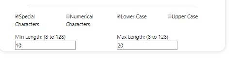
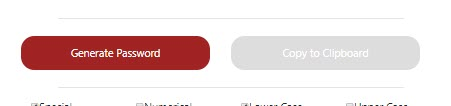
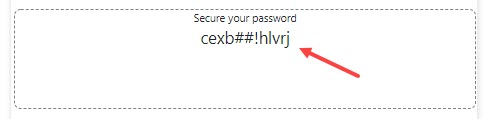

# homework3

--------- Section 1:Description -----------------
In this application you will be able to automatically create a password with characteristic that you choose. 

--------- Section 2: Instuctions ----------------
Note the option selections at the bottom. There must be at least on checkbox checked and numbers must be added to the min/max length fields. 

Once the options have been filled out, you can click the generate password but to create your password. 

Your output will post to the box.

You will be alerted if you make any mistakes with the proper error and fix.

---------- Section 3: Additional Details --------------
Have fun and be safe!
